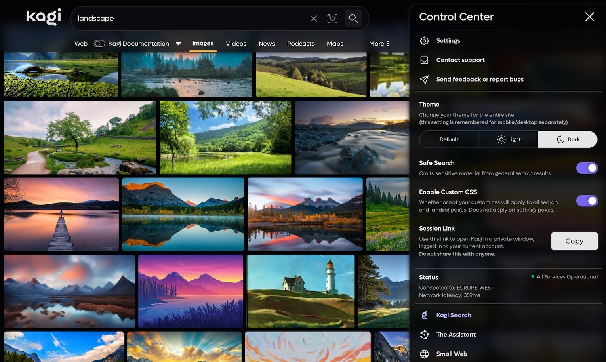
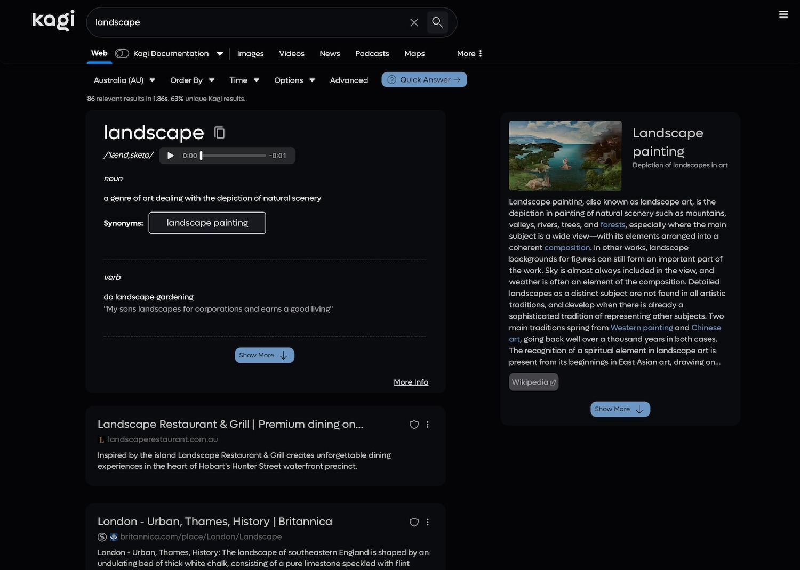

# Glassmorphism Style CSS File for Kagi Search Engine

Enhance your Kagi search experience with custom CSS animations and styles! It's a general overhaul of the search engine user interface and user experience.

**The original was created by pdanzma, and I've just made the whole experience darker, and changed the orange buttons to blue.**

---

---

---

## Overview

kagi-css is a custom CSS file to beautify and liven up the Kagi search engine interface. With this stylesheet, you can enjoy a more visually appealing and dynamic search experience while using Kagi. Mainly inspired by Google and Brave Search, but with many exciting innovations of its own!

## Features

- **Glassmorphism**: A glass-inspired design for the settings and navigation bar
- **Custom Animations**: Smooth transitions and eye-catching effects
- **Enhanced UI Elements**: Improved buttons, search bar, and results layout
- **Responsive Design**: Looks great on both desktop and mobile devices
- **Easy color changes**: There is a field at the beginning where you can easily change the most important colors as you wish
- **Uniform Design**: The design now extends to almost all pages, be it results, images, videos, news or podcasts.

## Installation

1. Download the latest `.zip` release from release tab.
2. Copy the settings in the image below for the main "Appearance" tab.
3. Paste the code into the inputfield at: [Link](https://kagi.com/settings?p=custom_css) & select Enable Custom CSS toggle.
4. Save and enjoy your enhanced Kagi experience!

   

## Animations

kagi-css includes several animations to make your search experience more dynamic:

1. **Results Fade-In**: Search results smoothly fade in as they load.
2. **Hover Effects**: Buttons and links have pleasant hover transitions.
3. **Search Tiles**: Also have beautiful animations.

## Any ideas / comments?

If you have an idea that would extend / complete the look of Kagi or if you have found a bug, please write to me on Discord or write in Discord: kagi-discussions -> “UI Design Ideas for my custom css”. [Link](https://discord.com/channels/1256077108111868035/1265596713083732060)

# Enjoy your enhanced Kagi search experience!
