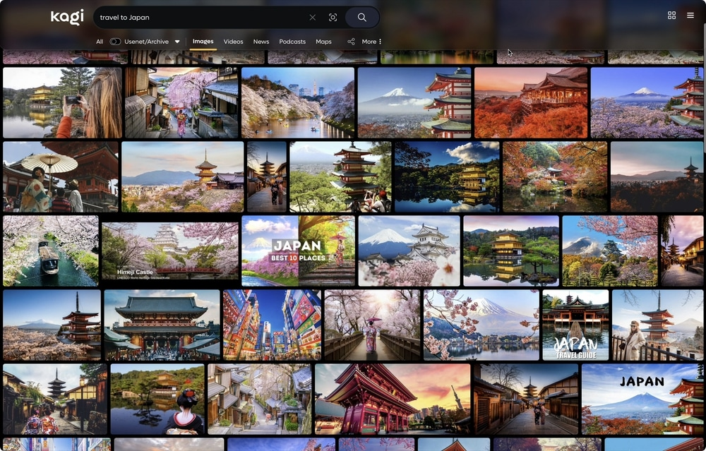
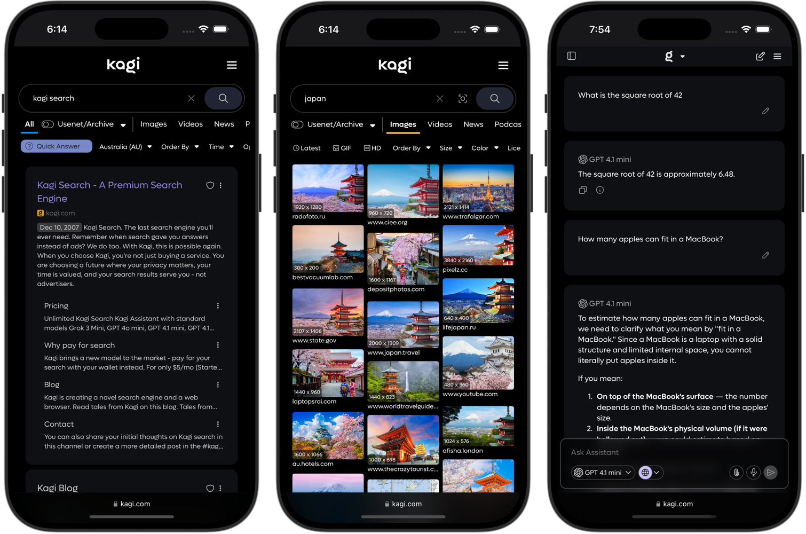
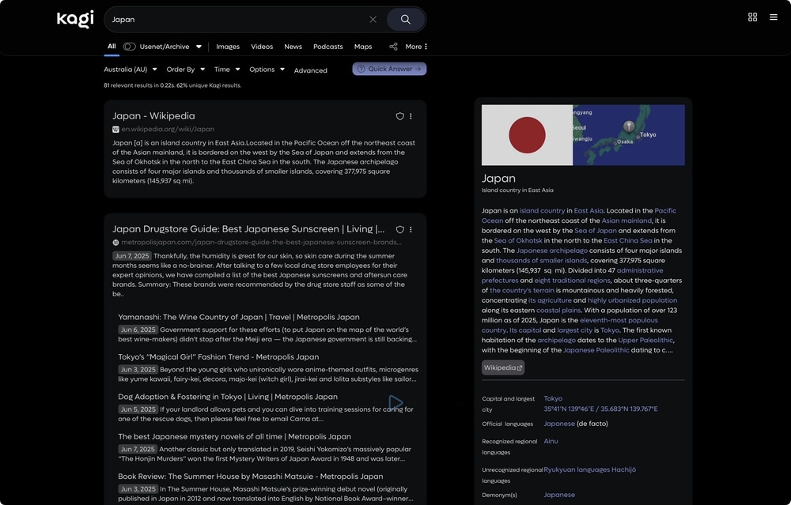
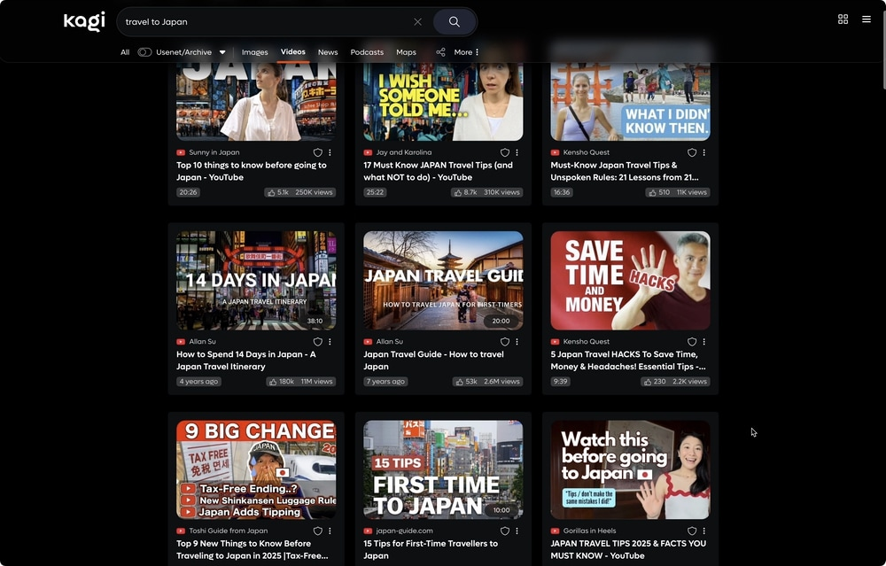

# Kagi Darker
## A Dark Glassmorphism Style CSS for Kagi Search

I built this dark theme as I wasn't satisfied with any other theme out there.

This is based on a wonderful theme by pdanzma, but I've heavily modified and cut it down to suit my tastes, and to fix bugs on mobile in particular.

**Please note that this only works with dark mode, it does not, and will not work with light mode.**

---

---

### More images available in the [Gallery](GALLERY.md)
---

## Installation

1. Download the latest `.zip` release from release tab.
2. Copy the settings in the image below for the main "Appearance" tab.
3. Paste the code into the inputfield at: [Link](https://kagi.com/settings?p=custom_css) & select Enable Custom CSS toggle.
4. Save and enjoy your enhanced Kagi experience!

   

## Feedback

If you've found a bug, please send me a Discord message @rogue.au

---

---

---
