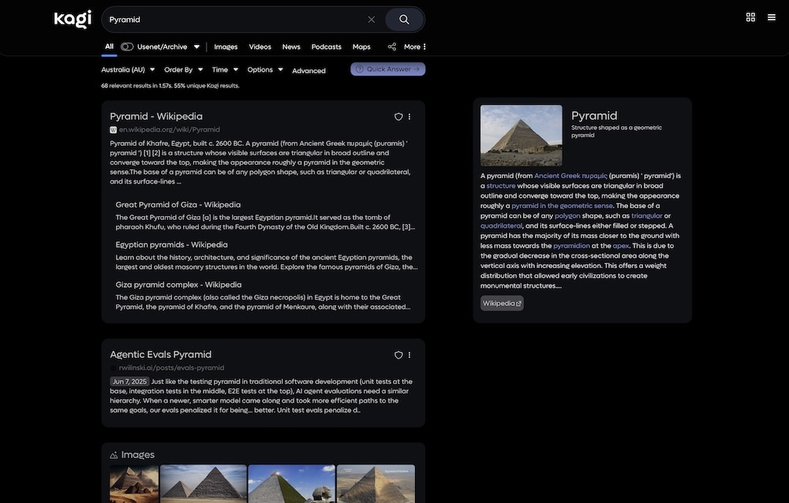

 

Upgrade (and darken) your <a href="https://kagi.com/">Kagi Search</a> experience.

<a href="#kagi-darker">Intro</a> &bull; <a href="#installation">Installation</a> &bull; <a href="#feedback">Feedback</a> &bull; <a href="GALLERY.md">Gallery</a>

-----

## Kagi Darker

I built this dark theme as I wasn't satisfied with any other theme out there. Inspired by Google and Brave Search.

This is based on a wonderful theme by [pdanzma](https://github.com/pdanzma/kagi-css), but I've heavily modified and cut it down to suit my tastes, and to fix bugs on mobile in particular.

⭐️ [Featured in the official Kagi Docs!](https://help.kagi.com/kagi/features/custom-css.html#kagi-darker) ⭐️

> [!IMPORTANT]
> This theme only works with dark mode, it does not, and will not, work with light mode.  
> Please follow [installation instructions](#installation) below.

---

### More images available in the [Gallery](GALLERY.md)

 

## Installation

1. Download the [latest](https://github.com/realrogue/kagi-darker/releases/latest) kagi-darker `.css` file.
2. Copy the ***entire*** contents of the css file.
3. Paste the css into the input field at [Kagi Settings](https://kagi.com/settings?p=custom_css) & turn on `Enable Custom CSS`.
4. Copy the settings in the image below in the `Appearance` tab.
5. Save and enjoy your enhanced Kagi experience!

   
  

## Feedback

If you've found a bug, please raise an issue, or comment on the [Discord thread here,](https://discord.com/channels/1256077108111868035/1298129343683493948) or the [Reddit thread here](https://www.reddit.com/r/SearchKagi/comments/1iclxjf/kagi_darker_a_glassmorphism_theme_inspired_by/)

**Known Issues**: none!

 
